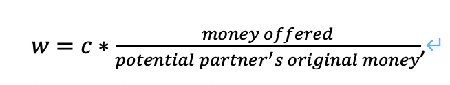
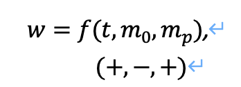

# # Title [How to Choice a Good Title?](https://www.nature.com/articles/s41562-021-01152-2)
## Project information
- **Author**: [First Name][Last Name], [Major], [Class], Duke Kunshan University
- **Instructor**: Prof. Luyao Zhang, Duke Kunshan University
- **Disclaimer**: Submissions to the Problem Set No. or Final Project for [COMPSCI/ECON 206 Computational Microeconomics, 2023 Spring (Seven Week - Second)](https://ce.pubpub.org/) instructed by Prof. Luyao Zhang at Duke Kunshan University.
- **Acknowledgments**: [How to Acknowledge?](https://www.scribbr.co.uk/thesis-dissertation/acknowledgements/)
[notes: please include all professors, students, and staff who have contributed to your completetion of the project.]
- **Project Summary**: 
  - [Summarize the Background/Motivation]
  - [Research Questions]
  - [Application Scenario]
  - [Methodology]
  - [Results]
  - [Intellectual Merits and Practical impacts of your project.]
  
   
Note: please insert the screenshot of the answers to your research question by ChatGPT. The methodology that you use to address the research questions must be more innovative than both the current literature and ChatGPT. 

## Table of Contents

- model
- code
- spotlight
- more about the author
- references

### Model
* Game environment <br>

	In ancient times, countries were endowed with different wealth and military forces of different intensities. Strong countries are always planning to use their military power to attack weak countries and annex their property. Vulnerable countries are always thinking about how to adopt strategies to address risks and protect their property.<br>

	Against this background, this is a trust game abstract from the ancient war between countries. Anyone with high fighting capacity can seize the wealth of those with low fighting capacity. Players with the same fighting capacity cannot seize wealth from each other. Players can form alliances, and their fighting capacity is the sum of both sides. They all want to get more wealth, or at least not worse off. <br>
	
	In this game, players will first need to decide on forming alliances with whom. Then, to persuade other players to ally with him, player 1 promises he won’t seize his partner’s money and can decide to offer some money to his potential partner to show his loyalty. After this, player 1’s target partner can see the money player 1 offer and redecide whether to cooperate with player 1. If they cooperate with player 1, player 1 will seize the remaining player’s money automatically. Next, player 1 will decide whether to break the cooperation and take his partner’s money.<br>
	
	
* Set of players <br>

	We assume that there are three players in this game. Each player has given the fighting capacity and money. <br>
Player 1 has 10 dollars, and his fighting capacity is 5.<br>
Player 2 has 3 dollars, and his fighting capacity is 2.<br>
Player 3 has 4 dollars, and his fighting capacity is 3.<br>

* Strategies <br>

	1.	No matter how much player 1 chooses to offer, player 2 and player 3 form an alliance and share 5 fighting capacities. <br>
	2.	Player 1 offers x dollars to player 2 and player 2 chooses to form an alliance with player 1. After seizing player 3’s money, player 1 breaks his promise and seizes player 2’s money.<br>
	3.	Player 1 offers x dollars to player 2 and player 2 chooses to form an alliance with player 1. After seizing player 3’s money, player 1 keeps his promise and doesn’t seize player 2’s money.<br>
	4.	Player 1 offers x dollars to player 3 and player 3 chooses to form an alliance with player 1. After seizing player 2’s money, player 1 breaks his promise and seizes player 3’s money.<br>
	5.	Player 1 offers x dollars to player 3 and player 3 chooses to form an alliance with player 1. After seizing player 2’s money, player 1 keeps his promise and doesn’t seize player 3’s money.<br>
	
	
* Payoffs (corresponding to the order of the strategies)<br>
	1.	Player 1 cannot attack player 2 and player 3, and player 2 and player 3 can protect their original wealth. As a result, player 1 will have 10 dollars, player 2 will have 3 dollars and player 3 will have 4 dollars.<br>
	2.	As a result, player 1 can have 17 dollars, player 2 and player 3 have 0 dollars.<br>
	3.	As a result, player 1 has (14-x) dollars, player 2 has (3+x) dollars, and player 3 has no dollars.<br>
	4.	As a result, player 1 can have 17 dollars, player 2 and player 3 have 0 dollars.<br>
	5.	As a result, player 1 has (13-x) dollars, player 2 has 0 dollars, and player 3 has (4+x) dollars.<br>
	
* Solution based on forward induction <br>

	Here we use forward induction to solve the game. Forward induction is based on the assumption that past play was rational. That is, players may form a belief of what types of other players are by observing their past actions. And players can make decisions based on their beliefs.<br>
	
	To disrupt other players’ cooperation, player 1 wants to cooperate with one of the other players, thus seizing the remaining player’s money. To reach cooperation, player 1 promises that he won’t seize his partner’s money after seizing another player’s money and offers part of his money to his partner at the beginning to show his loyalty. <br>
	
	Suppose that player2 and player3’s original willingness to form an alliance with player1 is 0 (with a maximum of 1). The more wealth player1 offer to his partner, the more his partner will believe that player1 will not ultimately disrupt their cooperation (i.e., not rob their wealth), and the more he is willing to cooperate with player1. The relationship between other players’ willingness to cooperate and the money player1 offered can be modeled as:

	
	
	where c refers to a constant parameter.<br>
	
	And the willingness for player 1 to break the cooperation and seize his partner’s money can be captured as:<br>
			
	
           
	where t refers to time, m_0 refers to player1’s current money, m_p refers to his partner’s current money. The longer the time, the more willingness for player1 to break the cooperation. The more money his partner has, the more possibility for player 1 to break his promise. And the money player 1 have is negatively related to his willingness to break the cooperation.<br>
	
	Based on this forward induction, the solution is that player 1 will offer money to player 2 and persuade player 2 to form an alliance with him successfully. After cooperating with player 2 and seizing player 3’s money, player1 will break the cooperation and take player 2’s money. Finally, Player 1 can have 17 billion dollars, while player 2 and player 3 can only have 0 billion dollars. <br>

* Efficiency and fairness<br>

	Efficiency: this is not applicable in this game. The total wealth among the three players is given and will not change according to how they behave.<br>

	Fairness: Under this solution, player 1 will get all the money, and player 2 and player 3 will have nothing. Hence, this solution is not a fair solution.


### Code
- Game Environment
- Strategic plays
- Equilibruim Evaluations: e.g. belief, strategy, and payoffs
- oTree Experimental Code 

* Description on how I customize the demo
	1. Endowment and multiplier <br>
	In oTree demo, I have changed the number of players to three. Moreover, in addition to having different money, each player is also endowed with different combat abilities. In the game, players will determine the strategy based on their initial combat power. The flow of the game is also pretty different from the demo. Multiplier is not applicable in my game. <br>
	
	2. Demonstration <br>

		There are three stages in the game. In the first stage, players first need to understand the consequences of forming an alliance with different players based on the game introduction, and then decide their strategies. If everyone is rational, player 2 will form an alliance with player 3, which means player 1 can’t seize their money.<br>
	
		In the second stage, in order to break this balance, player 1 will need to make a decision on how much he is willing to give his target partner to persuade the target partner to collaborate with him. Then his target partner will need to make a decision on whether or not to believe player 1 and cooperate with him. <br>

		In the third stage, once this player is persuaded by the conditions of player 1 and chooses to cooperate with player 1, player 1 will loot another player's wealth, and this player's wealth will be cleared automatically. Then, player 1 will need to make a decision on whether to keep his promise and not rob his partner’s money. After this decision, the game will end. <br>


### Spotlight


In this part, I will discuss the behavioral experimental research paper *Unintended effects of open data policy in online behavioral research: An experimental investigation of participants’ privacy concerns and research validity* (Liu and Wei 2022). Also, I will discuss the reinforcement learning algorithm paper *Dynamic trust game model between venture capitalists and entrepreneurs based on reinforcement learning theory* (Haiyan 2018). <br>

*Behavioral experimental research paper*

* What research question does the behavioral experimental research intend to address? <br>

	This research paper intends to address the problem about what are open-data policy’s effects on participants’ privacy concerns and their willingness to be honest, and what are the potential solutions to remove the unintended effect.
	
* How does behavior in the experiments differ from backward induction? <br>

	Based on the backward induction, since participants are worried about privacy violations, they tend not to continue the research or select “choose not to answer”. However, the result of the experiments shows that only the rate of affirmative answers (not their disclosure level) is significantly affected.
	
* What is the behavioral (e.g., psychological, social) foundation that underpinning the observed behavior? 
	1.	Participants care about the payment for attending the research. They don’t want to be rejected by researchers due to their apparent nondisclosure. So they sometimes will force themselves to be disclosed even when they feel uncomfortable.
	2.	Because people are afraid of privacy leaks, they tend to select answers that are in line with socially approved behaviors.

*Reinforcement learning algorithm paper*
* What is the game environment and the learning algorithm? <br>

	1.	Game environment<br>

		Venture capitalists conduct credit assessments on startups and provide financial support for them; Entrepreneurs receive financial support from venture capital companies and provide returns for them. Investors can profit from their investments, but if other participants do not follow the rules and fulfill their commitments, they will suffer losses. Therefore, trust is risky and uncertain. Venture capitalists and entrepreneurs need to make trust strategies in this situation.
	
	2.	Learning algorithm <br>
	
		Specifically, this paper uses a variant of the Q-learning algorithm called actor-critic Q-learning to learn the optimal strategy for both the venture capitalists (VCs) and the entrepreneurs in the game. <br>
		
		The algorithm consists of two main components: the actor and the critic. The actor is responsible for choosing the actions of the agent (either the VC or the entrepreneur), while the critic evaluates the chosen actions and provides feedback to the actor. The algorithm uses a reward function to determine the value of each action, and the goal is to maximize the cumulative reward over time.<br>

		Also, the paper introduces a novel trust metric that incorporates both the reputation and the personal relationship between the VC and the entrepreneur. The trust metric is used to update the reward function and to adjust the learning rate of the algorithm.

* How are the strategies from the reinforcement learning agents inspires you on trust building among humans? <br>

	The dynamic trust process between venture capitalists and entrepreneurs is a process of mutual learning. More specifically, venture capitalists and entrepreneurs make trust decisions based on their interactive experiences. Venture capitalists and entrepreneurs make trust decisions based on the returns at different stages and update their strategies and trust status accordingly. Venture capital firms can monitor the efforts of entrepreneurs by offering fewer investments in the early stages. Entrepreneurs can check the amount of venture capitalists' investment in the later stage to decide how much effort they will put in the future. <br>

	This inspires me that building trust requires both parties to sacrifice some of their interests at a specific time to showcase themselves. Although cooperation is mutually beneficial, before their trust is stable, both parties need to rely on most of their own actions and a small portion of the other party's help to reach some results in a short period, thus demonstrating their potential and credibility. Hence, the best way to gain the trust of people's potential partners as soon as possible is to compromise more interests at the beginning.

### More about the Author
- headshot
- self-introduction
- Final reflections 
  - intellectual growth
  - professional growth
  - living a purposeful life

### References

- Literature References in [Chicago Author-Date](https://www.chicagomanualofstyle.org/tools_citationguide/citation-guide-2.html) Style and [BibTex](https://scholar.google.com/) 

Levin, Dan, and Luyao Zhang. 2020. “Bridging Level-K to Nash Equilibrium.” *The Review of Economics and Statistics* 104 (6): 1329–40. https://doi.org/10.1162/rest_a_00990.

```
@article{levin2022bridging,
  title={Bridging level-k to nash equilibrium},
  author={Levin, Dan and Zhang, Luyao},
  journal={Review of Economics and Statistics},
  volume={104},
  number={6},
  pages={1329--1340},
  year={2022},
  publisher={MIT Press One Rogers Street, Cambridge, MA 02142-1209, USA journals-info~…}
}
```

